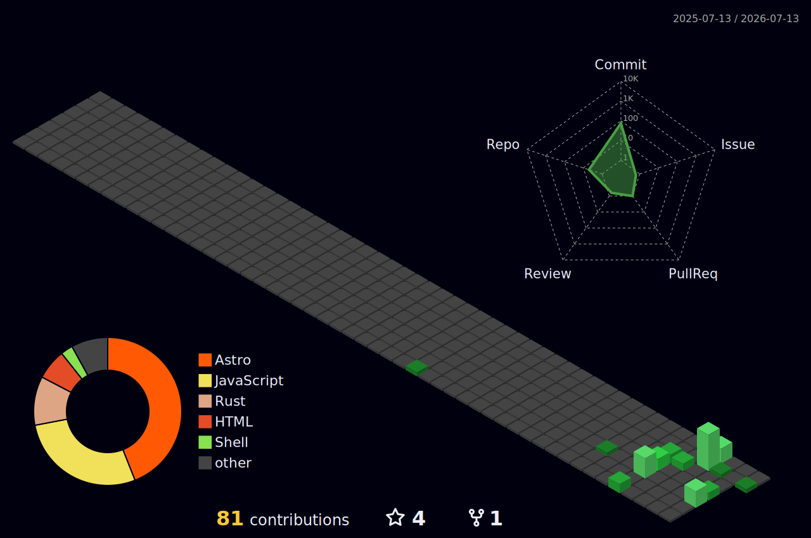

# Olá, eu sou o Matheus 👋

### Engenheiro Full-Stack · ~5 anos · Goiás, Brasil 🇧🇷

Construo **sistemas distribuídos, automação e ferramentas de dev** — de microsserviços
orientados a eventos a um homelab inteiro auto-hospedado. E gosto de deixar boa parte **open source**.

---

## 🚀 DevSplit — o que estou construindo agora

  

**Proxy de desenvolvimento que divide o tráfego do seu gateway de stage.** Os caminhos que
você escolher (`/auth`, `/transporte`, …) rodam no seu `localhost`; todo o resto faz
passthrough pro ambiente real. **Sem Docker, sem mudar o front** — ele cuida do TLS local
confiável, do `/etc/hosts` e do roteamento por path-prefix.

🌐 **[devsplit.app](https://devsplit.app)**  ·  💻 **[código (Rust + Tauri v2)](https://github.com/Matheuscara/devsplit)**  ·  🆓 Open source (MIT / Apache-2.0)

📸 <b>Telas do DevSplit</b>

 

    
    
  

---

## 🌍 Open source

Acredito que ferramenta boa se prova no código aberto. O que mantenho público:

| Projeto | Sobre | Stack |
|---|---|---|
| **[devsplit](https://github.com/Matheuscara/devsplit)** | App desktop que faz split de tráfego de stage por path-prefix | 🦀 Rust · Tauri v2 · React |
| **[claude-code](https://github.com/Matheuscara/claude-code)** | Config do meu Claude Code p/ infra: hooks de segurança, subagentes, skills, instincts | 🐚 Shell · IA |

---

## 💼 Experiência

| Período | Empresa | Papel | Destaques |
|---|---|---|---|
| **2024 → hoje** | **RodoJunior** | Dev Pleno / Líder técnico | Sistema de liberação de caminhoneiros via **Pix**: microsserviços + **event-driven**, NestJS 10 + Angular 19, PostgreSQL, BullMQ/Redis/RabbitMQ, **Clean Arch + DDD**, SSE em tempo real, CI/CD (GitHub Actions/Jenkins), infra do zero (Docker Swarm, Portainer, AWS). Integrações Qualp/Google Maps/Sem Parar. |
| **2022 – 2024** | **Banco Pan** | Eng. de Software Jr | Plataforma financeira de crédito: Angular 15 + NestJS, microsserviços, PostgreSQL/MongoDB, Cypress/Jest, SOLID/MVC. |
| **2021 – 2022** | **Take Blip** | Analista de Sistemas | Chatbots + integrações via API: Node.js, .NET/C#, React, Amazon SNS, Power BI. |
| **2021** | **ON GO Company** | Programador Jr | Full-stack p/ logística de insumos agrícolas: Node.js, .NET/C#, React. |

🎓 Análise de Sistemas (Infnet) · Front+Back-end (Trybe)  ·  🗣️ Português nativo · Inglês B2

---

## 🛠️ Stack

**Linguagens**

**Back-end**

**Front-end**

**Infra & DevOps**

**Dados & Mensageria**

**Observabilidade**

---

## 📊 GitHub

---

💬 **Aberto a conversas** sobre back-end, infra/DevOps, sistemas distribuídos e produtos open source.

<a href="mailto:matheus.dias.dev@gmail.com">matheus.dias.dev@gmail.com</a>

